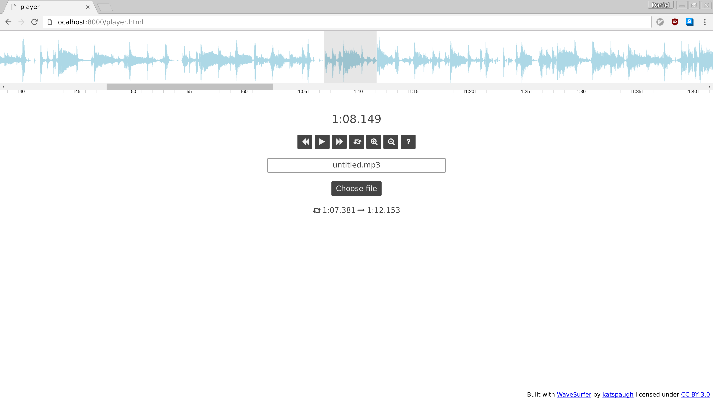
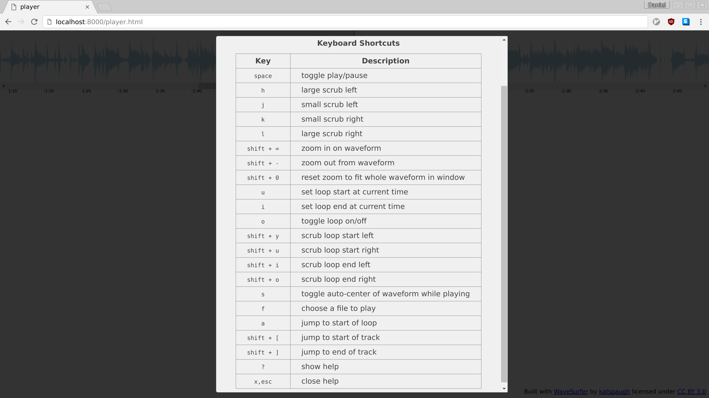

# Player

A browser-based audio player that has fine-grained scrubbing, looping, waveform view, zoom, and keyboard shortcuts.  To view the keyboard shortcuts for the different functions, click on the help button.





## Building

The build process depends on Node.js and Grunt.

```
npm install -g grunt-cli  # if you don't have Grunt installed globally already
npm install
grunt build
```

This compiles the HTML, JS, and CSS files and outputs them to build/player.html.  Everything needed to run the app client-side is contained in that single file, so it can be run from a local machine.  If you just want to try the app without installing Node and Grunt, grab the build/player.html file from this repo and open it in a browser.
